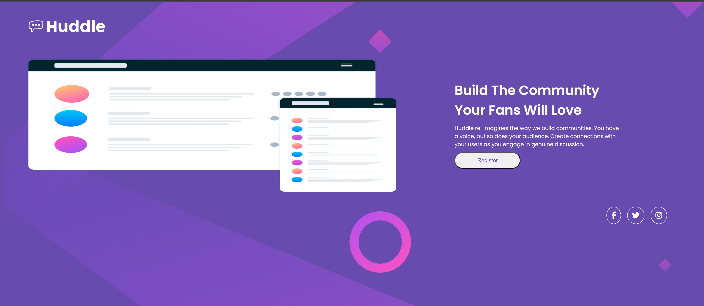

# Projeto huddle base

Desafio para testar os conhecimentos em html e css do curso Dev em dobro, usando o que foi aprendido em flexbox para desenvolver o layout de uma landing page simples e responsiva com uso das Media Queries.

## Índice

- [Sobre](#sobre)
- [Funcionalidades](#funcionalidades)
- [Screenshot](#screenshot)
- [Links](#links)
- [Tecnologias utilizadas](#tecnologias-utilizadas)
- [O que foi aprendido](#o-que-foi-aprendido)

## 📖 Sobre

Quando o usuário passar mouse sobre os botões de redes sociais ou registrar tem o efeito de mudar de cor mostrando as partes interativas da tela.

## ✨ Funcionalidades

- **Design Responsivo:** Adaptável a diferentes tamanhos de tela.

## 📷 Screenshot

## 🔗 Links

- Desafio URL: [Clique-aqui](https://www.frontendmentor.io/challenges/huddle-landing-page-with-a-single-introductory-section-B_2Wvxgi0)
- Site no ar URL: [Clique-aqui](https://khaledsilva.github.io/huddle-base/)

## 💻 Tecnologias utilizadas

- HTML5
- CSS3

## 📚 O que foi aprendido

Aprimorei meus conhecimentos sobre Flexbox e responsividade com uso de Media Queries apesar da dificuldade em usar Flexbox e ajustar cada item na tela.